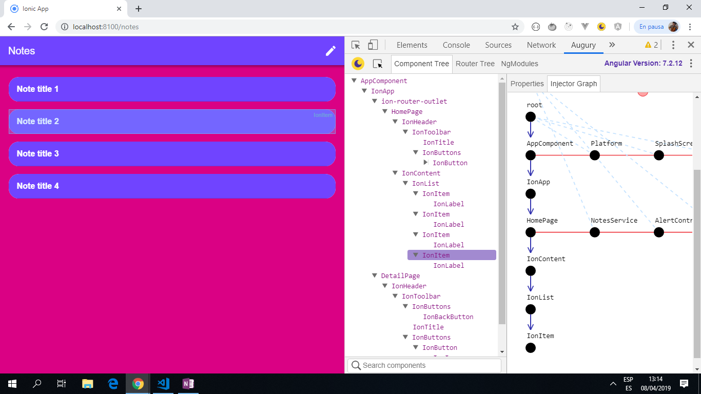
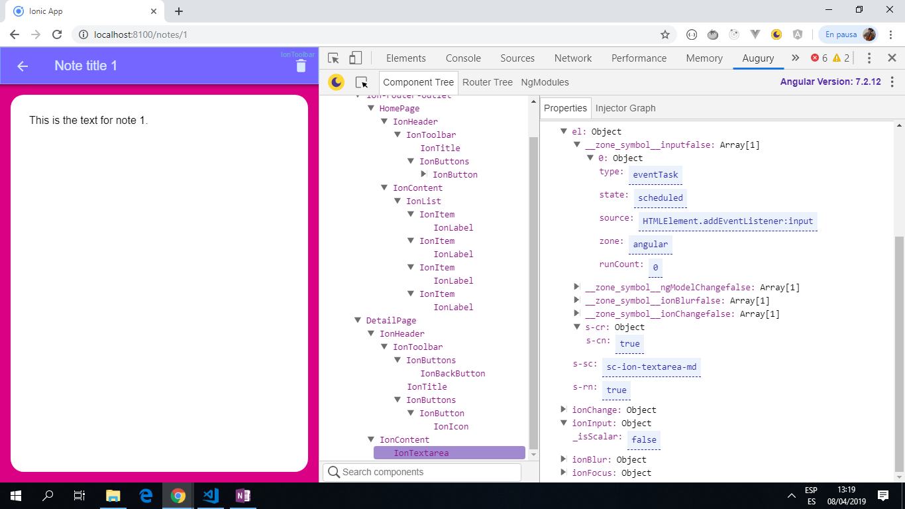

# Ionic Angular Notepad

Ionic 4 app to Create, Read, Update and Delete notes. Notes are stored and retrieved using the Ionic Storage component.

*** Note: to open web links in a new window use: _ctrl+click on link_**

## Table of contents

* [General info](#general-info)
* [Screenshots](#screenshots)
* [Technologies](#technologies)
* [Setup](#setup)
* [Features](#features)
* [Status](#status)
* [Inspiration](#inspiration)
* [Contact](#contact)

## General info

* This app only has 2 pages:

1. **Home** page with a list of note titles
2. **Detail** page with a text area so note details can be added and changed. The entire note can also be deleted from this page.

## Screenshots




## Technologies

* [Ionic framework v4](https://ionicframework.com/docs).

* [Ionic CLI v7.3.1](https://ionicframework.com/docs).

* [Angular 7.2.2](https://angular.io/).

* [Ionic Storage v2.2.0](https://www.npmjs.com/package/@ionic/storage), a simple key-value module with SQLite.

## Setup

* Install dependencies with npm install.

* Run app using `ionic serve` then navigate to `http://localhost:8100/`.

## Code Examples

* _Detail page showing the Ionic comoponents_

```html
<ion-header>
  <ion-toolbar color="tertiary">
    <ion-buttons slot="start">
      <ion-back-button defaultHref="/notes"></ion-back-button>
    </ion-buttons>
    <ion-title>{{ note.title }}</ion-title>
    <ion-buttons slot="end">
      <ion-button (click)="deleteNote()">
        <ion-icon slot="icon-only" name="trash"></ion-icon>
      </ion-button>
    </ion-buttons>
  </ion-toolbar>
</ion-header>

<!-- ngModel used for 2-way data-binding to update the content 
property of the note with any change in the <ion-textarea> value -->
<ion-content padding>
  <ion-textarea
    (input)="noteChanged()"
    [(ngModel)]="note.content"
    placeholder="...something noteworthy?">
  </ion-textarea>
</ion-content>
```

## Features

* A simple notepad application that uses many Ionic/Angular/Typescript core concepts such as:

1. Navigation/Routing
2. Templates
3. Two-way data binding
4. Interpolations
5. Event binding
6. Types and Interfaces
7. Services
8. Data Input
9. Data Storage
10. Styling

* This app allows the user to:

1. create, delete, and edit notes
2. Save and load those notes from storage
3. View a list of notes
4. View note details

* The ionic template default colors can be changed to:

1. primary
2. secondary
3. tertiary
4. light
5. danger
6. dark

## Status & To-Do List

* Status: fully working basic app with all CRUD functions available. If you refresh the browser the notes are still there.

* To-Do: add delete function to Home page. Add a createdAt date. Consider a theme change button to change colors.

## Inspiration

[JOSH MORONY's Ionic Tutorial: Building a Notepad Application from Scratch with Ionic](https://www.joshmorony.com/building-a-notepad-application-from-scratch-with-ionic/).

## Contact

Created by [ABateman](https://www.andrewbateman.org) - feel free to contact me!
